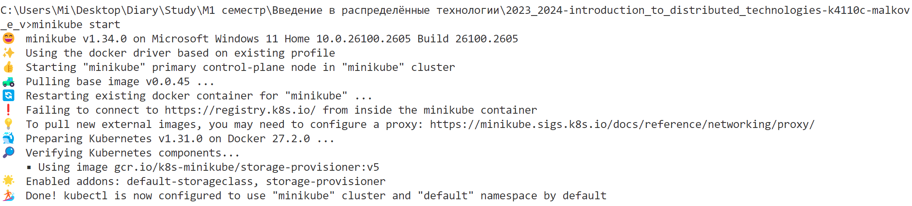
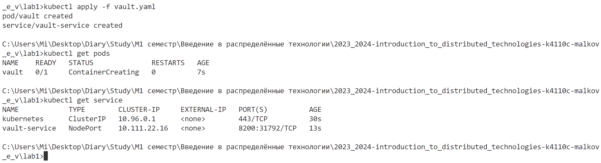
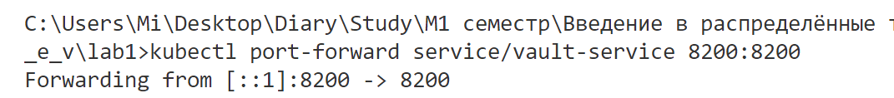
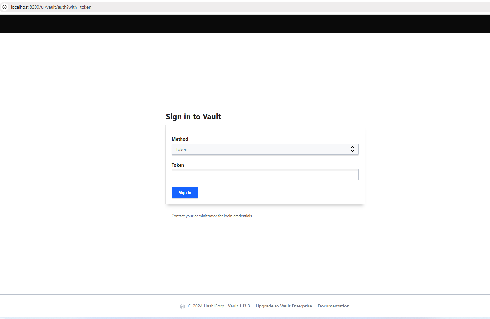
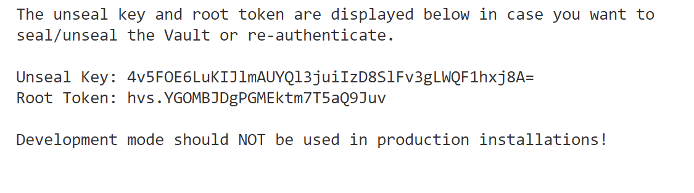
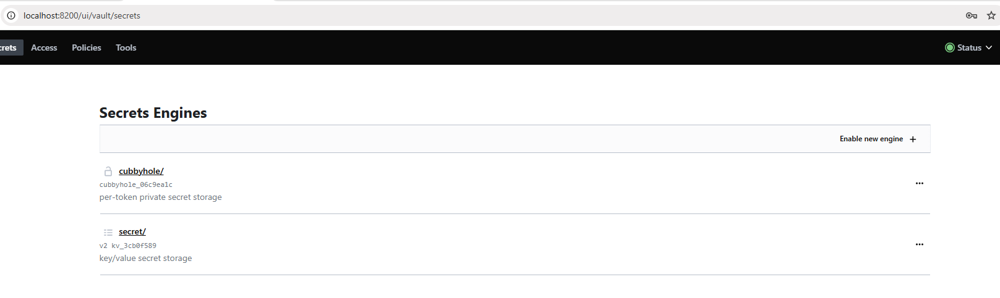
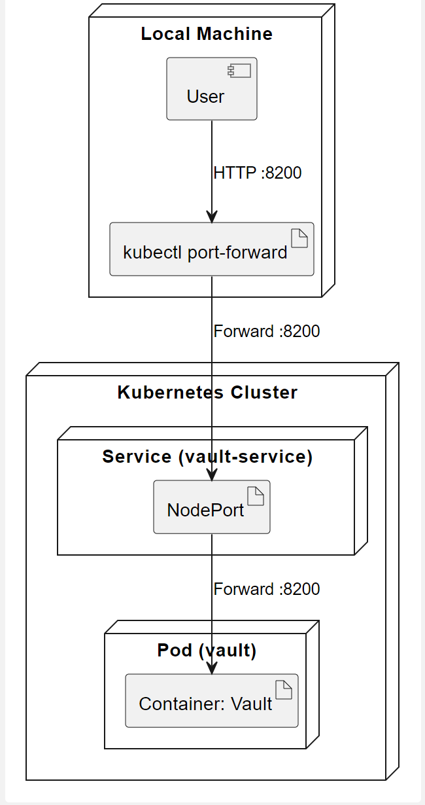

University: [ITMO University](https://itmo.ru/ru/)
Faculty: [FICT](https://fict.itmo.ru)
Course: [Introduction to distributed technologies](https://github.com/itmo-ict-faculty/introduction-to-distributed-technologies)
Year: 2023/2024
Group: K4110c
Author: Malkov Evgenii Vitalevich
Lab: Lab1
Date of create: 15.12.2024
Date of finished: 19.12.2024

## Разворачивание minikube кластера

Развернём minikube кластер с помощью команды `minikube start`

Как мы можем увидеть, кластер был запущен с использование docker. Minikube создал контейнер на основе образа kicbase/stable:v0.0.45. Также в сообщении мы можем увидеть то, что kubectl был успешно настроен.

## Запуск HashiCorp Vault

Для разворачивания "пода" Hashicorp Vault создадим манифест, в котом создадим под на основе образа vault:1.13.3, а также создадим сервис для доступа к поду.

```yaml
apiVersion: v1
kind: Pod
metadata:
  name: vault
  labels:
    app: vault
spec:
  containers:
    - image: vault:1.13.3
      name: vault
      ports:
        - name: vault-port
          containerPort: 8200

---
apiVersion: v1
kind: Service
metadata:
  name: vault-service
  labels:
    app: vault
spec:
  selector:
    app: vault
  type: NodePort
  ports:
    - port: 8200
      name: vault-port
      targetPort: vault-port
      protocol: TCP
```

Описание манифеста:

- Создаём под с именем vault и меткой app: vault
- Создаём контейнер на основе образа vault:1.13.3
- Открываем порт 8200 для доступа к поду
- Создаём сервис с именем vault-service и меткой app: vault
- Сервис будет доступен с помощью NodePort

Применим манифест с помощью команды `kubectl apply -f vault.yaml`

Как мы можем увидеть, под и сервис были успешно созданы.

Далее прокинем порт 8200 на локальную машину с помощью команды `kubectl port-forward service/vault-service 8200:8200`

Теперь мы можем обратиться к HashiCorp Vault по адресу http://localhost:8200

Для входа в HashiCorp Vault используем токен root, который был выведен в логах при запуске пода. Для этого введём команду `kubectl logs vault`, эта команда выведет логи пода, в которых мы можем найти токен root.

После ввода токена мы попадаем в HashiCorp Vault.


## Диаграмма развёртывания

В результате выполнения лабораторной работы было развернуто minikube кластер и под HashiCorp Vault. Диаграмма развёртывания представлена ниже. Код диаграммы можно найти [здесь](Attachments/diagram.wsd).


## Ответы на вопросы

1. Что сейчас произошло и что сделали команды указанные ранее?
   Команды указанные ранее позволили развернуть minikube кластер и под HashiCorp Vault.После применения манифеста был создан под с контейнером HashiCorp Vault, который слушает на порту 8200. Одновременно был создан сервис vault-service типа NodePort, который обеспечивает доступ к поду через этот порт. Команда kubectl port-forward перенаправила порт 8200 с сервиса на локальную машину.
2. Где взять токен для входа в Vault?
   Токен для входа в Vault можно найти в логах пода. Для этого нужно выполнить команду `kubectl logs vault`.
