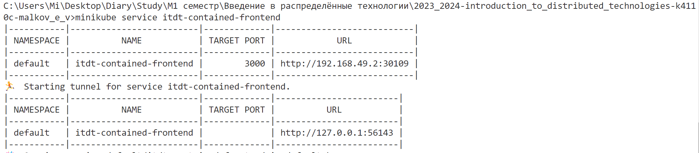

# Лабораторная работа №2 Развертывание веб сервиса в Minikube, доступ к веб интерфейсу сервиса. Мониторинг сервиса

```
University: [ITMO University](https://itmo.ru/ru/)
Faculty: [FICT](https://fict.itmo.ru)
Course: [Introduction to distributed technologies](https://github.com/itmo-ict-faculty/introduction-to-distributed-technologies)
Year: 2023/2024
Group: K4110c
Author: Malkov Evgenii Vitalevich
Lab: Lab2
Date of create: 19.12.2024
Date of finished: 19.12.2024
```

## Цель работы

Ознакомиться с типами "контроллеров" развертывания контейнеров, ознакомится с сетевыми сервисами и развернуть свое веб приложение.

## Ход работы

### 1.Развёртывание веб сервиса itdt-contained-frontend

Создадим deployment с 2 репликами и образом itdt-contained-frontend. Для этого создадим файл contained-frontend-deployment.yaml и заполним его следующим образом:

```yaml
apiVersion: apps/v1
kind: Deployment
metadata:
  name: itdt-contained-frontend
  labels:
    app: itdt-contained-frontend
spec:
  replicas: 2
  selector:
    matchLabels:
      app: itdt-contained-frontend
  template:
    metadata:
      labels:
        app: itdt-contained-frontend
    spec:
      containers:
        - name: itdt-contained-frontend
          image: ifilyaninitmo/itdt-contained-frontend:master
          ports:
            - containerPort: 3000
          env:
            - name: REACT_APP_USERNAME
              value: "admin"
            - name: REACT_APP_COMPANY_NAME
              value: "ITMO"
```

Далее создадим сервис для доступа к приложению. Для этого создадим файл contained-frontend-service.yaml и заполним его следующим образом:

```yaml
apiVersion: v1
kind: Service
metadata:
  name: itdt-contained-frontend
spec:
  selector:
    app: itdt-contained-frontend
  type: NodePort
  ports:
    - protocol: TCP
      port: 3000
      targetPort: 3000
```

Описание deployment и service:

1. Deployment создает 2 реплики приложения itdt-contained-frontend. В шаблоне pod указаны переменные окружения REACT_APP_USERNAME=admin и REACT_APP_COMPANY_NAME=ITMO.
2. Service itdt-contained-frontend позволяет получить доступ к приложению извне кластера по протоколу TCP на порту 3000. Тип сервиса NodePort.

Применим файлы манифестов:

```bash
kubectl apply -f contained-frontend-deployment.yaml
kubectl apply -f contained-frontend-service.yaml
```


Далее пробросим порт на локальную машину:

```bash
minikube service itdt-contained-frontend
```



В результате получаем доступ к приложению по адресу http://localhost:3000.


Как можно видеть, приложение работает, информация о пользователе и компании отображается корректно.
Также можно заметить, что при обновлении страницы данные о пользователе и компании не изменяются, т.к. env переменные заданы в deployment. k8s не создаёт различий между репликами при использовании deployment, каждая реплика получает одинаковые переменные окружения.

Однако можно заметить то, что значение Container name меняется, это связано с тем, что при обновлении страницы, k8s перенаправляет на другую реплику, что видно из значения IP адреса. Это связано с тем, что сервис NodePort балансирует нагрузку между репликами.

Проверим логи контейнеров:

```bash
kubectl logs itdt-contained-frontend-7f8fbb78b6-77zrt
kubectl logs itdt-contained-frontend-7f8fbb78b6-qbhkt
```


### 2. Диаграмма развертывания

Диаграмма развёртывания представлена ниже. Код диаграммы можно найти [здесь](Attachments/diagram.wsd).


## Вывод

В ходе выполнения лабораторной работы было развернуто веб приложение itdt-contained-frontend с помощью deployment и service. После этого мы смогли обратиться к приложению по адресу http://localhost:3000 и убедиться в его работоспособности.
