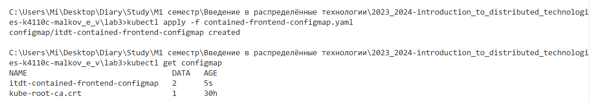
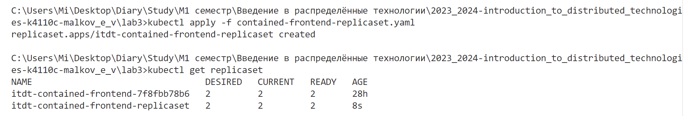
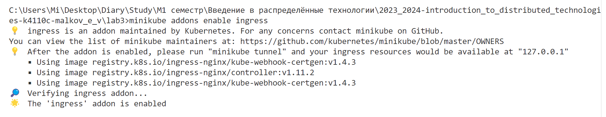
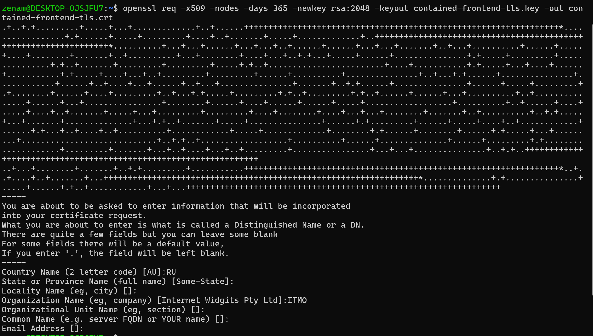
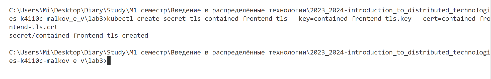
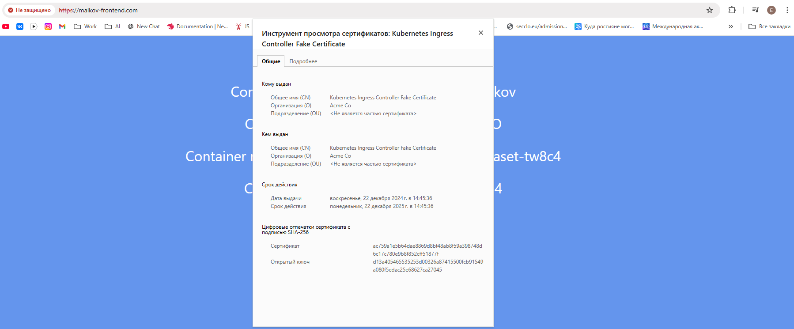
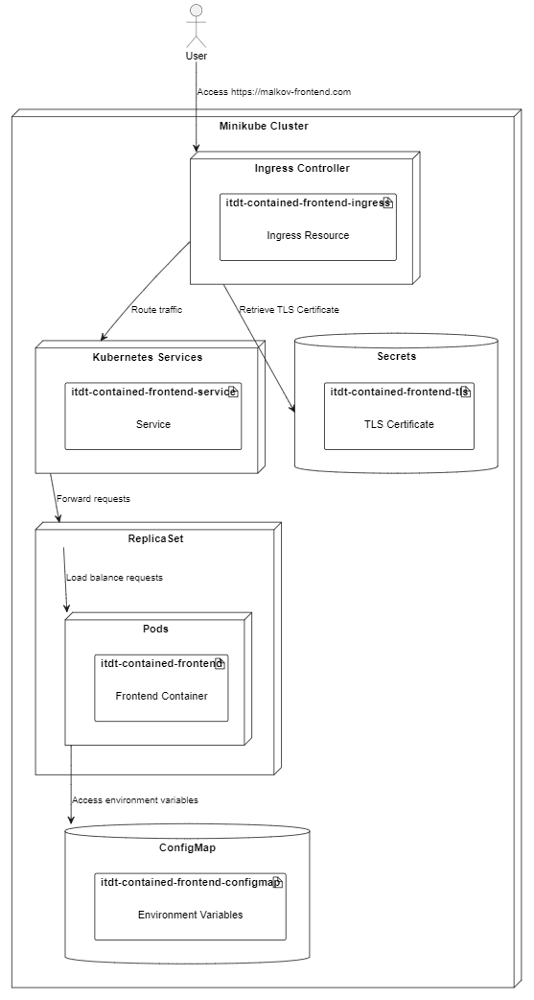

# Лабораторная работа №3 "Сертификаты и "секреты" в Minikube, безопасное хранение данных."

```
University: [ITMO University](https://itmo.ru/ru/)
Faculty: [FICT](https://fict.itmo.ru)
Course: [Introduction to distributed technologies](https://github.com/itmo-ict-faculty/introduction-to-distributed-technologies)
Year: 2023/2024
Group: K4110c
Author: Malkov Evgenii Vitalevich
Lab: Lab1
Date of create: 20.12.2024
Date of finished: 21.12.2024
```

## Цель работы

Познакомиться с сертификатами и "секретами" в Minikube, правилами безопасного хранения данных в Minikube.

## Ход работы

### 1. Создание configMap

Создадим configMap с переменными REACT_APP_USERNAME, REACT_APP_COMPANY_NAME. Для этого создадим файл contained-frontend-configmap.yaml:

```yaml
apiVersion: v1
kind: ConfigMap
metadata:
  name: itdt-contained-frontend-configmap
data:
  REACT_APP_USERNAME: "Evgenii Malkov"
  REACT_APP_COMPANY_NAME: "ITMO"
```

Для инициализации configMap выполним команду:

```bash
kubectl apply -f contained-frontend-configmap.yaml
```



### 2. Создание ReplicaSet

Создадим ReplicaSet с 2 репликами контейнера ifilyaninitmo/itdt-contained-frontend. Для этого создадим файл contained-frontend-replicaset.yaml:

```yaml
apiVersion: apps/v1
kind: ReplicaSet
metadata:
  name: itdt-contained-frontend-replicaset
spec:
  replicas: 2
  selector:
      matchLabels:
      app: itdt-contained-frontend
  template:
      metadata:
      labels:
          app: itdt-contained-frontend
      spec:
          containers:
          - name: itdt-contained-frontend
              image: ifilyaninitmo/itdt-contained-frontend:master
              ports:
              - containerPort: 3000
              env:
              - name: REACT_APP_USERNAME
                  valueFrom:
                  configMapKeyRef:
                      name: itdt-contained-frontend-configmap
                      key: REACT_APP_USERNAME
              - name: REACT_APP_COMPANY_NAME
                  valueFrom:
                  configMapKeyRef:
                      name: itdt-contained-frontend-configmap
                      key: REACT_APP_COMPANY_NAME
```

Для инициализации ReplicaSet выполним команду:

```bash
kubectl apply -f contained-frontend-replicaset.yaml
```



### 3. Создание сервиса и Ingress

Для начала создадим сервис для доступа к приложению. Для этого создадим файл contained-frontend-service.yaml:

```yaml
apiVersion: v1
kind: Service
metadata:
  name: itdt-contained-frontend-service
spec:
  selector:
    app: itdt-contained-frontend
  type: NodePort
  ports:
    - protocol: TCP
      port: 3000
      targetPort: 3000
```

Далее создадим Ingress для доступа к сервису. Для этого создадим файл contained-frontend-ingress.yaml:

```yaml
apiVersion: networking.k8s.io/v1
kind: Ingress
metadata:
  name: itdt-contained-frontend-ingress
spec:
  tls:
    - hosts:
        - malkov-frontend.com
      secretName: itdt-contained-frontend-tls
  rules:
    - host: malkov-frontend.com
      http:
        paths:
          - path: /
            pathType: Prefix
            backend:
              service:
                name: itdt-contained-frontend-service
                port:
                  number: 3000
```

Для инициализации сервиса и Ingress выполним команды:

```bash
kubectl apply -f contained-frontend-service.yaml
kubectl apply -f contained-frontend-ingress.yaml
```

Далее включим Ingress в Minikube:

```bash
minikube addons enable ingress
```



### 4. Создание сертификата

Создадим сертификат для доступа к Ingress по HTTPS. Для этого выполним команду:

```bash
openssl req -x509 -nodes -days 365 -newkey rsa:2048 -keyout contained-frontend-tls.key -out contained-frontend-tls.crt
```



Далее создадим секрет для сертификата. Для этого выполним команду:

```bash
kubectl create secret tls itdt-contained-frontend-tls --key=contained-frontend-tls.key --cert=contained-frontend-tls.crt
```



Далее добавим запись в файл /etc/hosts:

```bash
127.0.0.1 malkov-frontend.com
```

Также запустим minikube tunnel:

```bash
minikube tunnel
```

### 5. Проверка работы

Откроем в браузере https://malkov-frontend.com:


Как можно видеть, приложение работает корректно, сертификат был успешно создан и применен.

### 6. Диаграмма развертывания



## Вывод

В ходе лабораторной работы были изучены сертификаты и "секреты" в Minikube, а также правила безопасного хранения данных в Minikube. Был создан configMap с переменными REACT_APP_USERNAME, REACT_APP_COMPANY_NAME, ReplicaSet с 2 репликами контейнера ifilyaninitmo/itdt-contained-frontend, сервис для доступа к приложению, Ingress для доступа к сервису, сертификат для доступа к Ingress по HTTPS. Все действия были выполнены успешно, приложение работает корректно.
