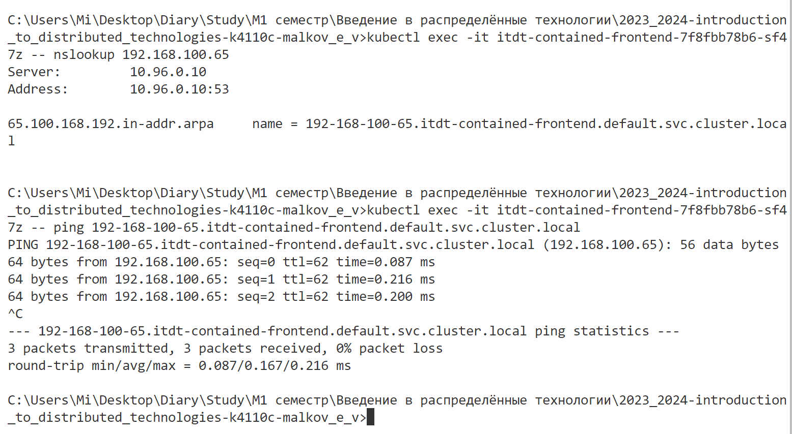

# Лабораторная работа №4 "Сети связи в Minikube, CNI и CoreDNS"

```
University: [ITMO University](https://itmo.ru/ru/)
Faculty: [FICT](https://fict.itmo.ru)
Course: [Introduction to distributed technologies](https://github.com/itmo-ict-faculty/introduction-to-distributed-technologies)
Year: 2023/2024
Group: K4110c
Author: Malkov Evgenii Vitalevich
Lab: Lab4
Date of create: 21.12.2024
Date of finished: 26.12.2024
```

## Цель работы

Познакомиться с CNI Calico и функцией IPAM Plugin, изучить особенности работы CNI и CoreDNS.

## Задачи

- При запуске minikube установите плагин CNI=calico и режим работы Multi-Node Clusters одновеременно, в рамках данной лабораторной работы вам нужно развернуть 2 ноды.

- Проверьте работу CNI плагина Calico и количество нод, результаты проверки приложите в отчет.

- Для проверки работы Calico мы попробуем одну из функций под названием IPAM Plugin.

- Для проверки режима IPAM необходимо для запущеных ранее нод указать label по признаку стойки или географического расположения (на ваш выбор).

- После этого вам необходимо разработать манифест для Calico который бы на основе ранее указанных меток назначал бы IP адреса "подам" исходя из пулов IP адресов которые вы указали в манифесте.

- Вам необходимо создать deployment с 2 репликами контейнера ifilyaninitmo/itdt-contained-frontend:master и передать переменные в эти реплики: REACT_APP_USERNAME, REACT_APP_COMPANY_NAME.

- Создать сервис через который у вас будет доступ на эти "поды". Выбор типа сервиса остается на ваше усмотрение.

- Запустить в minikube режим проброса портов и подключитесь к вашим контейнерам через веб браузер.

- Проверьте на странице в веб браузере переменные Container name и Container IP. Изменяются ли они? Если да то почему?

- Используя kubectl exec зайдите в любой "под" и попробуйте попинговать "поды" используя FQDN имя соседенего "пода", результаты пингов необходимо приложить к отчету.

## Ход работы

### 1. Установка плагина CNI=calico и режим работы Multi-Node Clusters в minikube

Запустим minikube с плагином CNI=calico и режимом работы Multi-Node Clusters, а также укажем количество нод равное 2:

```bash
minikube start --network-plugin=cni --cni=calico --nodes=2
```


Далее добавим ноду в кластер:

```bash
minikube node add
```

По итогу получаем 2 ноды:


Проверим работу CNI плагина Calico. Для это проверим количество подов с меткой `k8s-app=calico-node`:

```bash
kubectl get pods -l k8s-app=calico-node -n kube-system
```


Как видно, на каждой ноде запущен по одному поду с меткой `k8s-app=calico-node`.

### 2. Проверка работы Calico с использованием IPAM Plugin

Для проверки работы Calico с использованием IPAM Plugin создадим метки для нод:

```bash
kubectl label node minikube location=st-petersburg
kubectl label node minikube-m02 location=moscow
```

```bash
kubectl get nodes --show-labels
```


Теперь создадим манифест для Calico, который будет назначать IP адреса подам исходя из пулов IP адресов, указанных в манифесте:

```yaml
apiVersion: projectcalico.org/v3
kind: IPPool
metadata:
  name: st-petersburg-pool
spec:
  cidr: 192.168.100.0/24
  ipipMode: Always
  natOutgoing: true
  nodeSelector: location == 'st-petersburg'

---
apiVersion: projectcalico.org/v3
kind: IPPool
metadata:
  name: moscow-pool
spec:
  cidr: 192.168.200.0/24
  ipipMode: Always
  natOutgoing: true
  nodeSelector: location == 'moscow'
```

Для работы с calicoctl установим его с помощью скрипта с официального сайта:

```bash
Invoke-WebRequest -Uri "https://github.com/projectcalico/calico/releases/download/v3.29.1/calicoctl-windows-amd64.exe" -OutFile kubectl-calico.exe
```


Проверим установленные по умолчанию пулы:

```bash
kubectl get ippool
```


Удалим их:

```bash
kubectl delete ippool default-ipv4-ippool
```


Применим манифест:

```bash
kubectl apply -f calico-ipam.yaml
```


Проверим созданные пулы:

```bash
kubectl get ippool
```


### 3. Создание deployment с 2 репликами контейнера ifilyaninitmo/itdt-contained-frontend:master

Создадим манифест для deployment и для сервиса:

```yaml
apiVersion: apps/v1
kind: Deployment
metadata:
  name: itdt-contained-frontend
  labels:
    app: itdt-contained-frontend
spec:
  replicas: 2
  selector:
    matchLabels:
      app: itdt-contained-frontend
  template:
    metadata:
      labels:
        app: itdt-contained-frontend
    spec:
      containers:
        - name: itdt-contained-frontend
          image: ifilyaninitmo/itdt-contained-frontend:master
          ports:
            - containerPort: 3000
          env:
            - name: REACT_APP_USERNAME
              value: "admin"
            - name: REACT_APP_COMPANY_NAME
              value: "ITMO"
```

```yaml
apiVersion: v1
kind: Service
metadata:
  name: itdt-contained-frontend
spec:
  selector:
    app: itdt-contained-frontend
  type: NodePort
  ports:
    - protocol: TCP
      port: 3000
      targetPort: 3000
```

Применим манифесты:

```bash
kubectl apply -f contained-frontend-deployment.yaml
kubectl apply -f contained-frontend-service.yaml
```


### 4. Запуск режима проброса портов и подключение к контейнерам через веб-браузер

Запустим режим проброса портов:

```bash
minikube service itdt-contained-frontend
```


Как видно, сервис доступен. Также видно, что переменные `Container name` и `Container IP` изменяются.

Пропингуем соседние поды:

```bash
kubectl exec -it itdt-contained-frontend-7f8fbb78b6-65m4k -- nslookup 192.168.200.1
kubectl exec -it itdt-contained-frontend-7f8fbb78b6-65m4k -- ping 192-168-200-1.itdt-contained-frontend.default.svc.cluster.local

kubectl exec -it itdt-contained-frontend-7f8fbb78b6-sf47z -- nslookup 192.168.100.65
kubectl exec -it itdt-contained-frontend-7f8fbb78b6-sf47z -- ping 192-168-100-65.itdt-contained-frontend.default.svc.cluster.local
```




Как видно, пинги проходят успешно.

## Диаграмма


## Вывод

В ходе выполнения лабораторной работы были изучены CNI Calico и функция IPAM Plugin, а также особенности работы CNI и CoreDNS. Был развернут кластер Minikube с двумя нодами, установлен плагин CNI=calico и режим работы Multi-Node Clusters. Для проверки работы Calico была использована функция IPAM Plugin. Были созданы метки для нод, а также манифест для Calico, который назначал IP адреса подам исходя из пулов IP адресов. Был создан deployment с 2 репликами контейнера ifilyaninitmo/itdt-contained-frontend:master и переданы переменные в эти реплики. Был создан сервис, через который был доступ к этим подам. Был запущен режим проброса портов и подключение к контейнерам через веб-браузер. Были проверены переменные `Container name` и `Container IP`, а также попингованы соседние поды.
